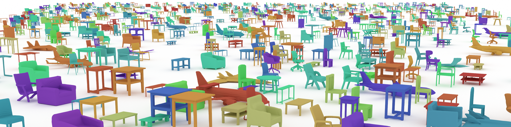

---
hide:
  - navigation
  - toc
---

# KAIST Geometric AI Group
KAIST Geometric AI Lab led by Prof. Minhyuk Sung focuses on developing novel machine learning techniques to solve fundamental problems in 3D geometric data processing and analysis. The 3D data, arising both from sensing the real world as well as in creating content by designers, are widely used in numerous applications in computer vision, computer graphics, and robotics. 3D data is distinguished from the other data modalities by its unique characteristics, such as sparsity, irregularity, fidelity (representing 3D objects as they present in the real world), and their roles as domains wherein the other information is defined (such as physical attributes and semantic annotations). Such characteristics introduce challenging research problems, which cannot be directly solved with conventional techniques developed to process regularly sampled signal data like audio and images. Our goal is to develop novel methodologies specialized in 3D based upon a profound understanding of its nature.

<!-- Link Swiper's CSS -->
<link rel="stylesheet" href="https://cdn.jsdelivr.net/npm/swiper@11/swiper-bundle.min.css" />
 

<!-- Swiper -->

<b> SyncDiffusion: Coherent Montage via Synchronized Joint Diffusions </b> 
A plug-and-play module that synchronizes multiple reverse diffusion processes, producing coherent images of various sizes without additional training.

 

<b> SALAD: Part-Level Latent Diffusion for 3D Shape Generation and Manipulation </b> 
A cascaded diffusion model based on a part-level implicit 3D representation.
  

<!-- Swiper JS -->

<!-- Initialize Swiper -->

